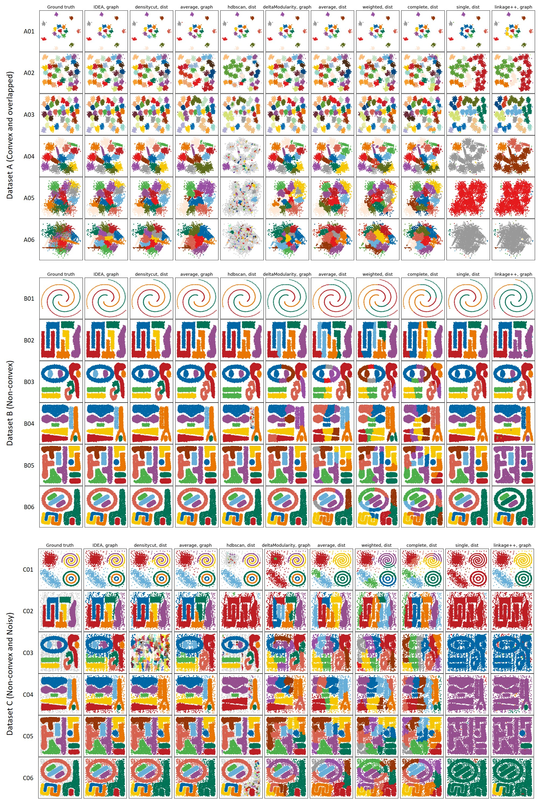

IDEA
====

IDEA (*Integrating Divisive and Ensemble-Agglomerate*) is a hierarchical clustering framework for arbitrary shape data (Python 3)

<br>
<br>

## Citation
Ahn H, Jung I, Chae H, Oh M, Kim I, Kim S\*. "IDEA: Integrating Divisive and Ensemble-Agglomerate hierarchical clustering framework with density-based tree search for arbitrary shape data" 2019. (Under review)

<br>
<br>

## Requirement
- Python 3
- scikit-learn (https://scikit-learn.org/stable/install.html)
- PyMetis (https://pypi.org/project/PyMetis/)

```bash
pip install scikit-learn
pip install pybind11
pip install pymetis
```

<br>
<br>

## Running example
```bash
python IDEA.py data/A01.data.points 15 -dataType datapoints -o A01.cluster -o2 A01.linkage -o3 A01.graph
python IDEA.py data/A02.data.points 31 -dataType datapoints -o A02.cluster -o2 A02.linkage -o3 A02.graph
python IDEA.py data/A03.data.points 35 -dataType datapoints -o A03.cluster -o2 A03.linkage -o3 A03.graph
python IDEA.py data/A04.data.points 15 -dataType datapoints -o A04.cluster -o2 A04.linkage -o3 A04.graph
python IDEA.py data/A05.data.points 15 -dataType datapoints -o A05.cluster -o2 A05.linkage -o3 A05.graph
python IDEA.py data/A06.data.points 15 -dataType datapoints -o A06.cluster -o2 A06.linkage -o3 A06.graph
python IDEA.py data/B01.data.points 3  -dataType datapoints -o B01.cluster -o2 B01.linkage -o3 B01.graph
python IDEA.py data/B02.data.points 6  -dataType datapoints -o B02.cluster -o2 B02.linkage -o3 B02.graph
python IDEA.py data/B03.data.points 9  -dataType datapoints -o B03.cluster -o2 B03.linkage -o3 B03.graph
python IDEA.py data/B04.data.points 8  -dataType datapoints -o B04.cluster -o2 B04.linkage -o3 B04.graph
python IDEA.py data/B05.data.points 10 -dataType datapoints -o B05.cluster -o2 B05.linkage -o3 B05.graph
python IDEA.py data/B06.data.points 9  -dataType datapoints -o B06.cluster -o2 B06.linkage -o3 B06.graph
python IDEA.py data/C01.data.points 7  -dataType datapoints -o C01.cluster -o2 C01.linkage -o3 C01.graph
python IDEA.py data/C02.data.points 6  -dataType datapoints -o C02.cluster -o2 C02.linkage -o3 C02.graph
python IDEA.py data/C03.data.points 9  -dataType datapoints -o C03.cluster -o2 C03.linkage -o3 C03.graph
python IDEA.py data/C04.data.points 8  -dataType datapoints -o C04.cluster -o2 C04.linkage -o3 C04.graph
python IDEA.py data/C05.data.points 10 -dataType datapoints -o C05.cluster -o2 C05.linkage -o3 C05.graph
python IDEA.py data/C06.data.points 9  -dataType datapoints -o C06.cluster -o2 C06.linkage -o3 C06.graph
python IDEA.py data/D01.data.dist.fullmatrix 11 -dataType dissimilarity -o D01.cluster -o2 D01.linkage -o3 D01.graph
python IDEA.py data/D02.data.dist.sparsematrix 5 -dataType dissimilarity -o D02.cluster -o2 D02.linkage -o3 D02.graph
```

<br>
<br>

## Data
20 datasets 

- 6 convex and overlapped datapoints (A01 - A06)
- 6 non-convex datapoints (B01 - B06)
- 6 non-convex and noisy datapoints (C01 - C06)
- 2 biological networks (D01 - D02))

| No. | The type of data | The number of clusters | The number of data points | Sources                          |
|-----|------------------|------------------------|---------------------------|----------------------------------|
| A01 | Data points      | 15                     | 600                       | [Veenman et al., 2002]           |
| A02 | Data points      | 31                     | 3100                      | [Veenman et al., 2002]           |
| A03 | Data points      | 35                     | 5250                      | [Karkkainen and Franti, 2002]    |
| A04 | Data points      | 15                     | 5000                      | [Franti and Virmajoki, 2006]     |
| A05 | Data points      | 15                     | 5000                      | [Franti and Virmajoki, 2006]     |
| A06 | Data points      | 15                     | 5000                      | [Franti and Virmajoki, 2006]     |
| B01 | Data points      | 3                      | 312                       | [Chang and Yeung, 2008]          |
| B02 | Data points      | 6                      | 7236                      | [Karypis, 2002]                  |
| B03 | Data points      | 9                      | 9208                      | [Karypis et al., 1999]           |
| B04 | Data points      | 8                      | 7677                      | [Karypis et al., 1999]           |
| B05 | Data points      | 10                     | 7676                      | [Ahn et al., 2019]               |
| B06 | Data points      | 9                      | 7675                      | [Ahn et al., 2019]               |
| C01 | Data points      | 7                      | 3673                      | [Jain,2010]                      |
| C02 | Data points      | 6                      | 8000                      | [Karypis, 2002]                  |
| C03 | Data points      | 9                      | 10000                     | [Karypis et al., 1999]           |
| C04 | Data points      | 8                      | 8000                      | [Karypis et al., 1999]           |
| C05 | Data points      | 10                     | 8000                      | [Ahn et al., 2019]               |
| C06 | Data points      | 9                      | 8000                      | [Ahn et al., 2019]               |
| D01 | Distance matrix  | 11                     | 301                       | [Pollen et al., 2014]            |
| D02 | Distance graph   | 5                      | 5804                      | [Ahn et al., 2017]               |

<br>
<br>

## Visualization result


[Veenman et al., 2002]: https://doi.org/10.1109/TPAMI.2002.1033218
[Karkkainen and Franti, 2002]: https://doi.org/10.1109/ICPR.2002.1048283
[Franti and Virmajoki, 2006]: https://doi.org/10.1016/j.patcog.2005.09.012
[Chang and Yeung, 2008]: https://doi.org/10.1016/j.patcog.2007.04.010
[Karypis, 2002]: https://www.cs.umn.edu/research/technical_reports/view/02-017
[Karypis et al., 1999]: https://doi.org/10.1109/2.781637
[Jain,2010]: https://doi.org/10.1016/j.patrec.2009.09.011
[Pollen et al., 2014]: https://doi.org/10.1038/nbt.2967
[Ahn et al., 2017]: https://www.ncbi.nlm.nih.gov/pubmed/28663756

